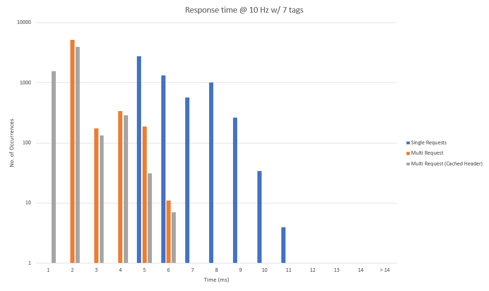

# Benchmarks Ether/IP:

| Measurement | Std. Deviation | Min | Max | Average |
|---      |---            |---     |---     |---    |
| Single Requests | 1,26008 | 4,011154 | 13,08298 | 5,664 |
| Multi Request without Cache | 0,736605 | 1,178026 | 6,05893 | 1,691 |
| Multi Request with Cache | 0,631197 | 0,793934 | 5,507946 | 1,235|

Measured at a rate of 10 Hz, with the maximum amount of tags supported by the PLC buffer in an unconnected send being sent (7), with a total size of 494 bytes per request. "Single requests" refers to a complete cycle where all 7 tags are read in singular requests. In no moment is EPICS involved, all results use only the driver.

The utilization of a cache to improve performance is not advisable and may result in instability. It is also not supported while reading EPICS scanlists and is meant only to provide a "what-if" scenario.

PLC: 1756-L85E Controllogix 5580

# "EtherIP" driver/device support module for EPICS.

Interfaces Allen Bradley PLCs (see www.ab.com) via Ethernet to EPICS IOCs

 * ControlLogix 5000,
   both original versions with separate controller and ENET module,
   and L8x series that includes a network port in the controller.
 * Compact Logix devices

Support EPICS R3.14.8 and higher.

For earlier version of EPICS base, including R3.13, see tags older than ether_ip-3-0.

See 

 * https://controlssoftware.sns.ornl.gov/etherip for more
 * changes.txt for changes
 * https://github.com/EPICSTools/etherip for a Java version of the basic communication library, not connected to an EPCIS IOC.

See Manual.md for usage
